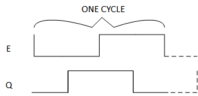
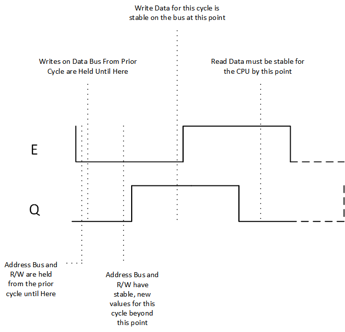
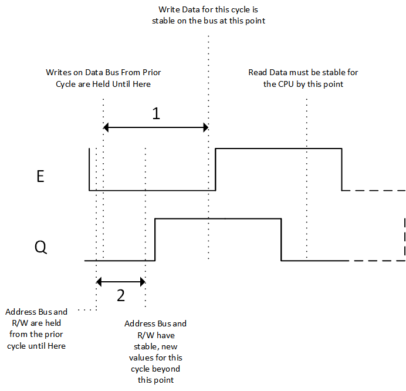

# MC6809 Specifics

I merely want to mention a few tidbits, rather than attempt to cover the 6809 in general.  The best reference is the MC6809 and MC6809E Motorola datasheets.  (Although on a few occasions, I found the Hitachi datasheets to clearer on details that were vague in the Motorola datasheets.)

## Clocking

The MC6809 and the MC6809E differ primarily on the origin of the quadrature clocks, E and Q.  The 6809 receives a singular clock that is 4x the desired rate of E and Q (either through driving a crystal or from an oscillator), and it *generates* E and Q.  The 6809E expects external circuitry to provide E and Q.  The latter case tends to be more flexible, while the former is more of a straight-and-simple solution.  

E and Q together describe the 6809's bus behavior.  Both clocks run at the same rate; however, Q "leads" E by 90 degrees (one quarter period).  A single bus cycle begins at the falling edge of E through to the next falling edge of E, as shown in the diagram below:

The MC6809 and MC6809E datasheets have *all* of the critical timing data, and I won't attempt to recreate that here.  However, I do need to point out a few specifics:

1. You should not always consider the bus valid.  A simple perspective would be that the bus is only valid when E is high.  That isn't perfectly accurate, though.  The Address bus and R/W are guaranteed to be valid before the rising edge of Q, Write data is available on the Data bus before the rising edge of E (specifics as to how much in advance of these edges are in the MC6809 datasheet, and vary depending on clock speed).

2. The 6809 actually latches the address bus and R/W at a particular time after the falling edge of E.  A real 6809 is combinatorial, but the latching minimizes the transition effect of one value to another.  This actually isn't guaranteed in the MC6809 datasheet, but some designs depend on it.  (Depending on it is somewhat dangerous.  You might very rarely see a problem, but during a transition you might have an instant of 'write' to an address other than what is intended - even with the latching.)  The correct design strategy is to only depend on the Address bus, the Data bus, and the R/W signal (as well as signals such as BS and BA) when they're guaranteed to be valid (if E and Q are both low, they're in a state of transition).

3. The 6809 latches the Data bus on read on the falling edge of E.  Data is required to be valid and stable well before the falling edge. A real MC6809 as well as an internal-to-an-FPGA implementation requires *some* Hold time after the falling edge.  Internal-to-an-FPGA doesn't require a tremendous amount, and if E and Q are in sync with the clocks providing internal resources, effectively none.  

Stating that something must/will be stable at a clock edge means that it actually needs to happen *before* the edge.  The actual cycle is more accurately as follows:

The specifics of the exact amount of time between these points and different edges is listed in the MC6809 datasheet, Figure 1.

The point about not depending on a bus that isn't guaranteed to be stable is highlighted in the following diagram.  In the area marked by a '1', the Data Bus is not stable.  For Writes, it will transition between values in an indeterminate manner.  For a Write to a Read or a Read to a Write, it can be variable.  The CPU driving the bus while a peripheral also drives it (to different states) is an ugly current sink.  In the area marked by a '2', the Address Bus and R/W (as well as BS and BA) is not stable.  They are transitioning from the prior state to the current state.  

 

## Bus Related Signals

The 6809 can cede the address and data busses as well as the R/W signal if requested (all three are tristated).  The /HALT signal asks the CPU to do so when the current instruction is complete.  The /DMABREQ signal (which only exists on the 6809, not on the 6809E) is *very* similar, except that every 15 cycles, the CPU will wake and reclaim the bus for the purpose of - and this is the word used in the Motorola datasheet - "refresh".  There are two output signals from the 6809 that indicate multiple states or indications: BA and BS. When both of these signals are set to '1', the 6809 is off of the bus and stopped.  

On the 6809, a signal called 'MRDY' exists.  Normally high, driving MRDY low indicates that "memory is not ready".  The 6809 will then *stretch* the E and Q clocks by multiples of a quarter period.  If a peripheral needs to be accessed that happens to be slow, the CPU effectively stalls until the peripheral is ready.  Note that this *cannot* exist on the 6809E, as the E and Q clocks originate from an external source.  *That* source could have a similar functionality, but the 6809E is a slave to those clocks and cannot modify them.

The 6809E offers a signal that's convenient for CPU designers (or annoying people reimplementing the CPU in an FPGA), but less valuable to others - LIC.  *Last Instruction Cycle* goes high on the cycle representing the last cycle; LIC is extremely useful in delineating the end of the last instruction and the beginning of the next instruction.

There are lesser used signals, such as AVMA (which is intended to be predictive at permitting non-CPU devices to know explictly when the 6809 plans to actively use the bus in the next cycle (as opposed to having the bus entirely unused for a cycle).  BUSY is intended to provide a mechanism by which atomic actions could be created with a bit of glue.  TSC permits a Tristate (Three-State Control) over the busses and R/W, albeit with a fairly heavy-hand.  [TSC is one the signals I've never seen actively used.]  Again, refer to the MC6809 and MC6809E datasheets for the actual details.

