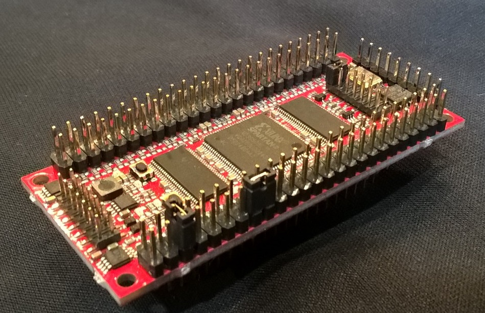
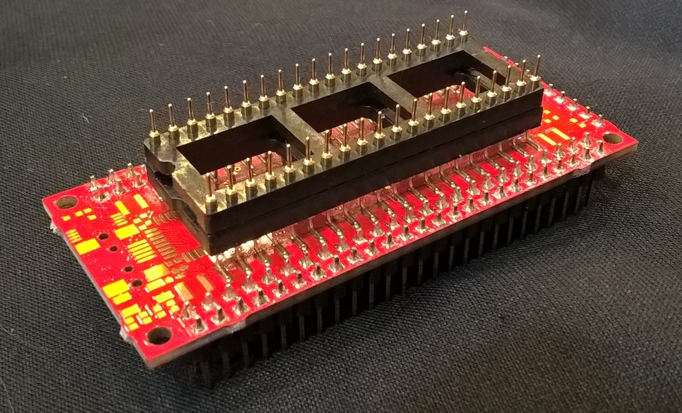
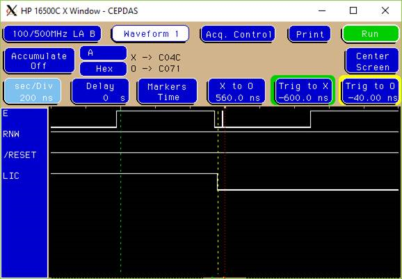

# GODIL

## The GODIL Board

The GODIL board is made by [OHO Elektronik](http://www.oho-elektronik.de).  Oversimplifying, the GODIL is a board with a 40 or 48-pin Dual-In-Line (DIL) 'plug' on the bottom of the board, a Xilinx Spartan 3E FPGA on the top, a 50Mhz oscillator, and a bidirectional 5V tolerant buffer on every pin.

The Spartan 3E is either the XC3S250 or the XC3S500.  All of my work was on the XC3S500 because the primary distributor [trenz electronic](http://www.trenz-electronic.de) was regularly out of stock of the 40-pin DIL version of the GODIL with the smaller-capacity FPGA.  [I eventually ended up with two of the XC3S250 boards purely by buying boards without the plugs on them and without 0.1" headers on the top of the board and post-soldering them on myself.]

The Spartan 3E isn't remotely a new component - the Spartan 3 family dates back a fair number of years.  However, for the work of implementing a 40 or 48 pin Dual In-Line (DIL - note that the name really means "Go, DIL!") part from the late 1970s or early 1980s, it's plenty of capability.  

The soft core fits on either the XC3S250 or the XC3S500.  You can fit two on the larger part if you wanted to.  (The 6809 has some limited ability to multiprocess; limited in value because it's a very bus-reliant CPU.)  

Those close to me know that although I can critique things that I perceive as sloppy or borrowed or cheap copies, I can also adore someone's clean, concise effort.  The GODIL is a wonderful piece of work.  The designer balanced performance and price wonderfully.  He avoided the 5V morass deftly.

It's a wonderful design, laid out in a beautifully compact board.  *I wish I'd done it*.

Although I don't claim to understand its entire market, I wish the designer the greatest success.  

The boards aren't *perfect*.  There are qualities that they cannot provide in a practical sense, and there are edge cases surrounding the 5V/3.3V buffering.

The 5V/3.3V buffering actually eliminates the ability to specify the FPGA drive strength.  A particular output cannot be driven to a higher level of current - as the only thing you're driving is the buffer, which has its own predefined current limit.  In general, this hasn't proven to be a problem for me.  It is good to recognize, though.

Here's a pair of images of a 40-pin GODIL, top and bottom:

(Top)

 
(Bottom)

Note the 100 pins of headers on either side of the module.  The GODIL can emulate up to a 48-pin chip (i.e., 24 pins per side; for a 40-pin DIL, the first 2 pins and the last 2 pins on each side's end are unused).  It does, however, expect that Vcc and GND will be on two of the pins.  Those headers are cleverly laid out so that each of the 48 signals is alternated with the board's Vcc and GND.  You can configure the board to support a 40-pin chip with Vcc and GND on *any* of the DIL pins this way; you can also use some of the jumpers as configuration if you so desire (along with a pullup or pulldown resistor in the FPGA).  In the picture, I have jumpers in the positions to select pin 1 of the 40-pin layout as GND and pin 7 as Vcc.

The headers are incredibly convenient when doing development, as it's easy to connect probes to the signals you desire to sample.  

If you look carefully at the bottom of the board, I actually have a machined socket plugged into the bottom of the board to give it slightly more height in order to avoid nearby components on one of the platforms I tested against.

## Edge cases for a 6809

As I eluded earlier, the GODIL isn't perfect.  However, short of designing a board explicitly for a certain part that you wish to implement in an FPGA, "perfection" (or suitably close to it) is impossible.  That said, the GODIL comes darned close.  

The 6809E receives the E and Q clocks externally.  The E and Q signals are inputs to the chip.  Some careful reading of Motorola documentation finds that E is listed as required to be driven much closer to Rail-to-Rail than typical TTL pins.  (Q does not share this.)  Textually, there's a comment in Motorola's documentation about this requirement existing due to E directly driving NMOS logic in the component.  Some wonderful reading that's related is the Intel 8080's requirement of a clock that ran from 0V to (9V-12V), despite having 5V logic signals (albeit not exactly TTL).

This rail-to-rail driving of E caused a problem for me later; I saw ringing on E on the falling edge (it likely existed on the rising edge as well, but disappeared as VIH for TTL is 2V, and ringing at 5V would need to be amazing to be noticed).  Particularly, I'd see a recognizable undershoot/overshoot/undershoot/etc. that quickly decayed.  However, the first overshoot in the list sometimes shot above the LVTTL 0.7V VIL, placing 'E' in a situation where the FPGA interpreted an extremely short 'spike' in the clock signal.  This is discussed in the MC6809E implementation's text, below.

The 6809 also has a special case in regards to its /RESET signal.  The designers intended the CPU to come out of /RESET *last*, after peripherals.  The easiest way to do that was to set VIH for the /RESET signal at 4V (instead of the typical TTL 2V).  As the bidriectional buffers insulate the FPGA from voltages above 3.3V, it really isn't impossible to trigger at 4V on the GODIL.  In the GODIL implementation of the core, /RESET deasserting triggers a countdown before releasing the internal logic from a reset state.  

## Implementing the soft core on the GODIL

Concepts like tristated signals only have places at pins/pads of an FPGA.  Modules internal to an FPGA tend to use dedicated **in** and **out** paths as they're simply more efficient than attempting to share signals internally.

### Filtering the E clock

As described above, the 'E' clock on some systems is driven almost rail-to-rail (which is intentional) infers 'ringing' at the falling edge of E when the instantaneous voltage swings past GND and begins a sinusoidal increasingly dampened undershoot/overshoot cycle.  From a logic perspective, depending on the E clock can end up with something similar to the actual capture below:

From the perspective of the logic, where there's a rising edge of E fairly quickly after the falling edge of E (which is the defined end of the prior cycle), it typically sets up a scenario where setup and hold aren't met, and the soft core attempts to advance a cycle when one didn't actually happen.  

There are multiple methods to deal with this kind of an issue.  I found the problem frustrating as it was important to me to have the ability to vary the rate of the E clock dynamically as some of my test vehicles actually use.  Thus, a DCM synchronized to the rate of the incoming E clock would be problematic as it would cite losing lock as E dynamically changed rates, and possibly miss cycles as it attempted to re-lock.

As the ringing was visible only after the falling edge (I've explained elsewhere that it likely happens after the rising edge as well, but the low VIH along with it being driven to the 5V rail likely means that I'm simply not seeing it, as it would have to swing 3V on the first undershoot to affect me), I chose to *filter* the clock.  This wasn't ideal, but seemed to me to be the best trade-off.  Filtering infers *delay*.  The glitch appears to be actually quite narrow, but delaying the E clock isn't ideal.

The GODIL has an oscillator onboard.  Although I greatly prefer to avoid vendor-specific mechanisms where possible, the GODIL isn't designed with an Altera component - it's designed with a Xilinx Spartan 3E.  Thus, I chose to use a DCM to obtain a clock 6x that of the Oscillator.  The Oscillator is 49.152Mhz, so the generated clock is 294.912Mhz, which is within the functional, acceptable range of the Spartan 3E series.  

Thus, the E clock is sampled at the rate of 294.912Mhz, into a 24 bit shift-register [which is used as well to provide latching of different busses - described later].  The first sample is E (which could be delayed 0ns to 3.4ns, depending on the synchronization of E and the sampling clock.  Bit 1 is literally Bit 0 `AND` the current value of E.  Bit 2 is Bit 0 `AND` Bit 1 `AND` the current value of E.  The point is that E needs to be high for three consecutive samples before it's considered legitimately high.  (Bits 3 through 23 are merely shifted and infer a 3.4ns delay per bit.)

The primary filtered clock is listed as:

    wire EFilterSrc = EDelay[1] & EDelay[0] & E;

... which calculates to between 6.8ns and 10.2ns delay due to filtering (depending on the synchronization at any instant between the clocks).  Note that this doesn't include the inferred delay of the rising edge by the filtering process, fortunately that isn't incredibly troublesome.

If you intend to use the soft core at a vastly faster clock rate on an external bus, I'd suggest ensuring that you avoid attempting to interface with an E clock driven to the rails, as 10.2ns isn't critical on a CPU running at a few Mhz; it would begin to become increasingly important on a CPU running at 10s of Mhz, though.  (Of course, this is immaterial if you're running the CPU at a much higher rate internal to an FPGA, as in some of the samples.)

Note: On a GODIL implementation for a 6809, rather than a 6809E, there's no clock filtering performed.  The E clock is an *output* in that case.  However, the same shift register is used, and it's used for the purpose described in the next section.

### Signal Hold Time

As described [here](./6809Details.md), the 6809 has a bus cycle end at the falling edge of E.  Different signals are latched and held, though; a transition instantly at the falling edge of E would make write data difficult to handle at best.  

If the prior bus transaction was a Write, the data bus is held constant for a specific amount of time.  The 6809 datasheet lists the amount of time that one should expect the bus to be held constant after the clock cycle has ended.  

The address bus, R/W, and a handful of other signals are also held.  Once more, the documentation for the 6809 lists the amount of time one should expect.

The 6809 documentation gives minimum expectations; in reality, it holds both busses for longer periods of time than listed (naturally).  In several cases, I've seen systems that expect the behavior of a 6809, even though the dependency was greater than the 6809 datasheet says that you should depend on.  

I found some platforms where holding data for slightly more than the datasheet limits was *not* sufficient.  They had been designed to expect something more than the datasheet stated, but consistently provided by 6809 parts.  

This proved to be somewhat frustrating; to be compatible, I couldn't depend on meeting the timing specifications of the 6809, I had to meet the actual timing performance of a hard 6809.  Eventually, I used a logic analyzer to measure different scenarios at different clock rates on both Motorola and Hitachi 6809s (and I measured a Hitachi 63C09E as well for good measure).  

I discovered that the Address bus and R/W were held for a certain period of time; sensibly (when you think about it) *less* than write-data.  [Sensibly because if R/W transitions from a read to a write, so long as the correct write data appears on the bus eventually everything will be fine; the opposite - where write data isn't held as long as R/W - might cause the wrong data to be written.]

The "flip side" of the scenario is the point within a cycle when the new cycle's address, R/W, and data are presented.  Recall that the soft core is combinatorial.  At the beginning of a new cycle, the signals move into flux; they're guaranteed valid at certain points in time - and the most common usage is to require that 'E' be high for any Chip Select to be valid.  As I've mentioned elsewhere, the 6809 datasheet states that the bus should be considered in flux during a zone of time that lies between the hold-time-after-the-prior-cycle and signal-stability-prior-to-the-rising-edge-of-Q.  Despite that, that isn't exactly what the 6809 does, and there are designs that depend on the latter rather than the former.  

While the soft core exposes a combinatorial result directly on the busses, the hard 6809 is not.  It latches the outgoing data after they've settled in the core and presents that latched value.  The result is that this behavior is what needs to be copied.

If you scan the implementation (either for the 6809 or the 6809E) on the GODIL, you'll find several delayed copies of the E clock used for triggering multiple events: (the falling edge of which is the event listed)

    EFilterAddr - Latch the outgoing Address Bus and R/W from the CPU.  These aren't presented yet, merely latched.  (~35ns after cycle)
    EFilterBusRnW - Latches the R/W signal from the CPU.  This is intentionally done separately from the R/W latch in EFilterAddr. (~50ns after cycle)  
    EFilterBus - Latch the output data from the soft core's data bus. (~75ns after cycle)

The value that actually determines the input/output direction of the data bus is latched at `EFilterBusRnW`; however, the value *output* on the R/W pin is latched at `EFilterAddr`.  This is strange, but intentional.  The hard 6809 continues to drive the data bus even after it begins presenting a '1' (a read state) on the R/W pin.

As a side-effect, recognize that write data on the data bus will be held for at least 50ns.  If another write follows, it will be held until the new data replaces the old at roughly 75ns after the end of the cycle.

Measuring existing silicon and duplicating the timings for the GODIL was a particularly frustrating experience.  It did demonstrate that matching the datasheet alone was insufficient if I wanted to be 'compatible'.  

### RESET

There are two facets to the /RESET signal dealt with in the GODIL implementation.

First, a POR - a Power On Reset is implemented.  At initialization, a POR signal is generated so that the core definitively resets on startup.  It only lasts a few cycles.

More critically, the /RESET input is both filtered and extended.  The filtering is incidental as it's relatively heavy-handed due to the extension (the extension is due to the 4V VIH on the hard 6809 being unreachable in the 3.3V core with a 2V LVTTL VIH).  Basically, once RESET is seen as active (low), the latched version of RESET is set active.  Once the external input is seen as inactive (high), a counter begins to decrement.  If the external input is seen active again, the counter is reset to `MINIMUM_RESET_SETTLE_CLOCKS`.  Once the counter is about to hit 0 (well, it's being decremented and is currently at '1'), the latched internal copy of the signal is marked as inactive (high).  This causes a delay after the /RESET signal is seen as '1' to try to compensate for the inability to sense 4V, and any bounce (from a switch, for instance) to be filtered out.

