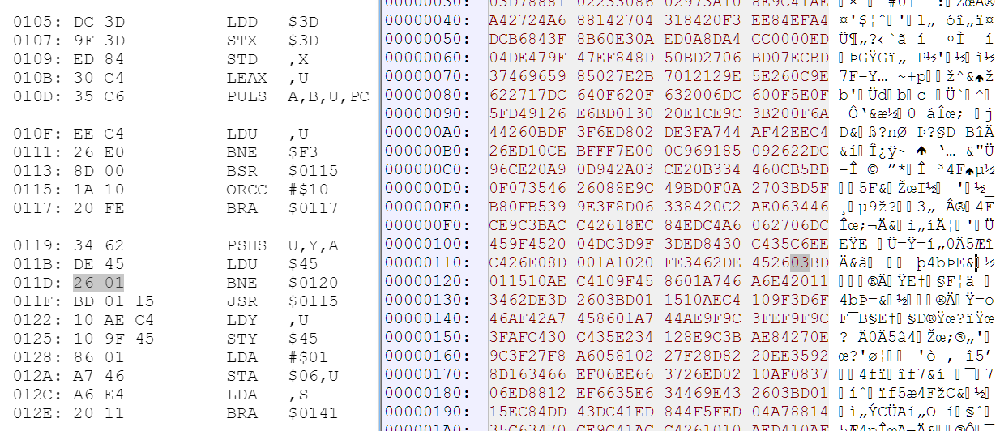

The Williams Stargate subroutine at $119 contains a minor error. At $11D if the value of the U register is nonzero, the BNE instruction jumps incorrectly into the middle of the next instruction.

The intent is to skip over the JSR $115. Instead the code jumps to $120, executing $01 $15. $01 is documented as an invalid opcode, however the Motorola 6809 actually executes it as NEG <$15. In contrast, the Hitachi 6309 traps on the illegal instruction.

The code at $11D can be patched to execute BNE $0122 instead of BNE $0120 as follows. 

Assuming the first Stargate ROM is a file named "01" with SHA-1 hash *f003a5a9319c4eb8991fa2aae3f10c72d6b8e81a* use the following command line:

    echo "11e: 03" | xxd -r - 01

Alternately change $2601 to $2603 using a hex editor.

End result is a file with SHA-1 hash *6a467d3619dae915d192c3b5171064a5c273c870* which is now Hitachi 6309 compatible.
