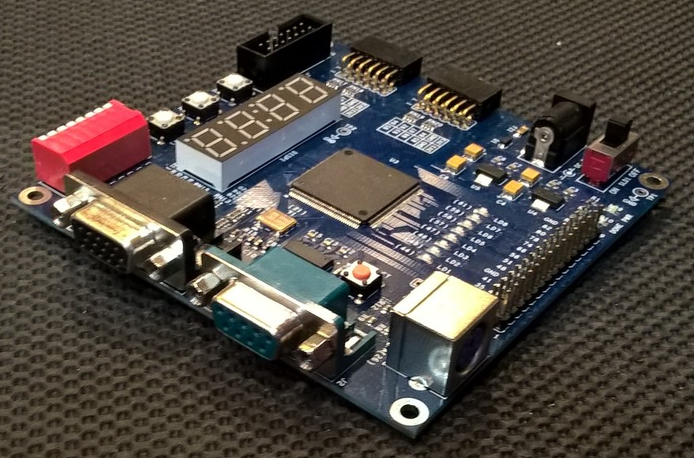
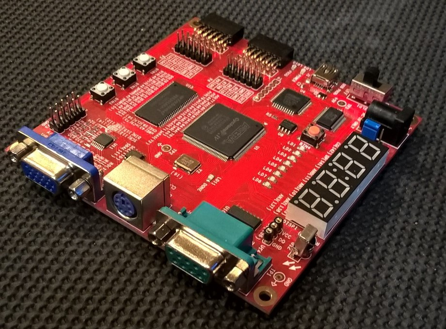
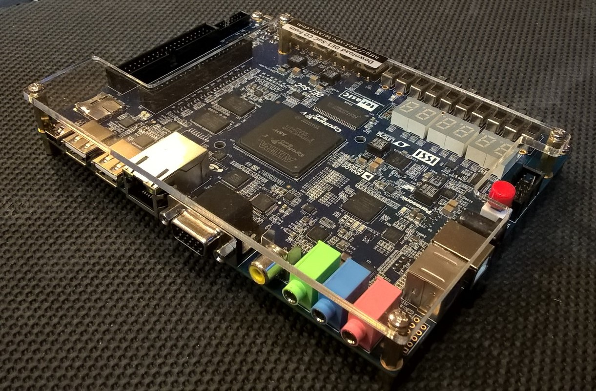
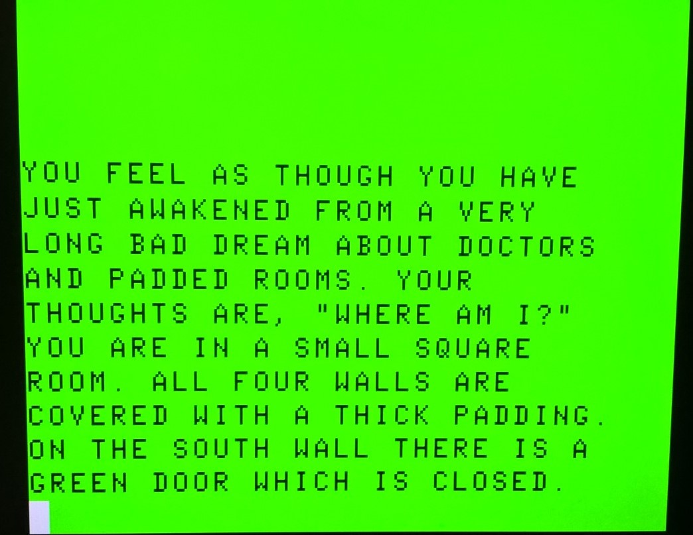
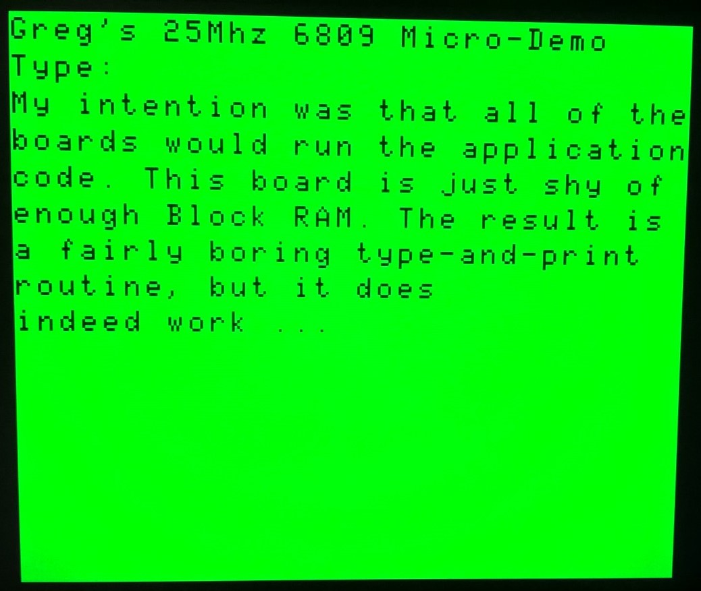

# Samples

The [GODIL ](godil.md)serves as a sample of applying the core to an entirely external scenario.

I had wanted to create a sample that was a mix - say SRAM external, but everything else internal - but ran out of time.

The alternative sample I have has been generated over multiple boards - boards I happened to have around for the most part - and my goals were:

 - CPU + RAM + ROM entirely internal to the FPGA (ROM + RAM = Block RAM)
 - Run the CPU at a higher clock rate - if only to demonstrate doing so.
 - Output some sort of video.
 - Input from a keyboard (PS/2 is easiest by far)
 - Start some sort of textual application.

**For the most part, the same sample runs on each of the boards below.**

I don't take great pride in most of the surrounding modules for the sample. I didn't go nuts trying to ensure that all warnings were dealt with; the VGA implementation was stolen from an HDMI module that I wrote a while back.  I picked a VGA mode that I could easily generate a pixel clock for - 800x600 w/ a 40Mhz pixel clock.  

The PS/2 input was cobbled together quickly.  It doesn't do PS/2 transmits; only receives.  I only wanted default PS/2 keyboard input - I didn't want to read a mouse or set keyboard modes or change keyboard lights.

The CPU utilized the 6809 rather tha 6809E model.  I wanted it to generate E and Q for me.

All of the RAM and the ROMs are FPGA block RAM.  To make my life very easy, I dual-ported the system RAM and the video subsystem reads from a dedicated port.  

With 800x600, what to display?  I could easily pad the edges and show an 80x24 text display.  I ran it once with 100 characters horizontally by 50 rows.  I didn't have a good reason for doing so.

Purely out of novelty, I decided to show a cheap imitation of the TRS-80 Color Computer's 32x16 display.  In pixels, that's 256x192.  To fit into an 800x600 display, I doubled the 256 horizontal pixels into 512.  I tripled the vertical 192 pixels into 576.  I then centered the resulting 512x576 display in the 800x600 display.  (In truth, the display looks a bit too square, but it's certainly good enough for a demo.)  That means that there's 144 pixels of black space on the left of the 'text area' and 144 pixels of black space on the right of the 'text area'.  There's 14 pixels above the 'text area' and 14 pixels below as well.  

Since I was imitating out of novelty, I borrowed the CoCo 3's character set.  [Note:  I didn't map it exactly the way the MC6847 or later, the GIME, did - and that came back to bite me later.]

For an application, hmmm - that was tricky - what *text* application existed that was written entirely in assembly that would do ... well, *anything*?  (A terminal program seemed absurd.) (I considered emulating the Color Computer's graphics modes and running a shoot-em-up, but this became a slippery slope that I didn't want to pursue.)  I eventually decided that I could find a text adventure from the Color Computer.  The Color Computer had two notable vectors offered to programmers - 'POLCAT' (check to see if a key is pressed and return the ASCII keycode if so) and 'CHROUT' (print the ASCII character in register A; scroll if necessary, etc.)  If I found one that only used CHROUT and POLCAT, that'd be a good sign for me.  I could implement my own versions of those routines that read a PS/2 FIFO and convert from a PS/2 code to ASCII; I could implement the ASCII-CHROUT routine and bypass the character set differences.  As you'll read later, that didn't go entirely smoothly.

For the CPU speed, it wasn't an incredibly deliberate choice - most of the boards I was using had 100Mhz or 50Mhz oscillators on them.  They all had PLLs.  I figured "100Mhz as the 4x clock, let the CPU run at 25Mhz".  The combinatorial examination suggests that the CPU would run at about 40Mhz on the Spartan 3, Spartan 6, and Cyclone IV parts.  When I synthesized it for a Kintex-7 board (which isn't in my list, it wasn't convenient), Vivado suggested that the combinatorial maximum frequency for that setup was ~60Mhz.  [If I changed the design, it likely could clock faster - but would actually need to start using the cycles that are currently doing nothing; i.e., spread the work out over more cycles.  More wouldn't *necessarily* get done in faster time, but it likely would synthesize to a higher safe clock speed.  The best throughput would likely be eliminating the accuracy 'dead' cycles and running at a reasonable clock rate.]  Note that the Combinatorial maximum isn't a practical maximum.  Signal latency is trivial at 2Mhz.  At 20Mhz, it begins to skew.  To have the address lines set up well in advance of a clock cycle, you need low latency.  

## Boards

I intentionally targeted both Xilinx and Altera-based boards.  

Some folks have angry feelings about FPGA boards from China.  For me, it's been touch-and-go.  I'll point out two that were cheap and convenient.  There were others where the seller was just reselling something from inside China, and no examples were available other than a website that was entirely in Chinese.  [I'm only fluent in one language.  Some would claim that I'm flattering myself with 'fluent', actually.]

### LX9

This is an eBay China Special - I obtained it from a seller whose tag is 'eepizza'.  It's a Spartan 6 LX9, so a relatively small Spartan 6.  It does have VGA out and a PS/2 port - which is an upside.

### EP4CE6

Very similar (but not identical), and also from 'eepizza' on eBay, this is a fairly small Cyclone IV.  It also has a VGA out (fewer bits per pixel than the LX9 board), and has a PS/2 connector.  This board has SDRAM (I don't recall if it's SDRAM or DDR-2) onboard, but as I was attemptinmg a generic solution that crosses boundaries, I didn't attempt to use it.

### Terasic DE-1 SoC Board

Amusingly, this board has a hard ARM core onboard.  I already had the board here, and as a Cyclone V, it seemed convenient.  The board has wayyyy more ports on it than an eBay special, but it's also 5x the price.  :)  The board has SDRAM (DDR-3?), and again, I didn't use it.  (I believe there's an SRAM part on there too; I'm not sure if it's reachable from the FPGA side or only the hard-ARM side.)  [Oh, and yes, I found it ironic that I was using an FPGA with a hard ARM core to run a soft MC6809 core.  <shrug>  I had the board here .. ]

### Terasic Cyclone V GX Starter Kit

I had intended to pursue this board; IIRC, it has SRAM.  It has HDMI out (which isn't a huge stretch after you have VGA working, believe me), and lots of goodies like an SD Card slot - it doesn't have a PS/2 port.  Adding one against the header would be very easy.  If anyone wants to volunteer to do so, please do - I'm happy to get the sample working on it.  Given enough time, I'll do it myself.  I'm including it as it was in my intended list, **despite not being supported today**.

## General structure

I have a root directory with Verilog modules that are shared among all or some of the targets.  Subdirectories contain Verilog modules specific to the target.

I didn't hesitate to use basic Xilinx and Altera IP for things like PLLs and Block RAM-as-ROM.  

There are basically 3 directory levels from this perspective; there's the primary level, which has the 6809 core in it.  There's the level of the Samples directory, which has the shared Verilog files.  Lastly, the files in the individual directories that are for the particular targets.

The central core of the sample is the module `demo_root` (in demo_root.v).  It's the 'top' module in an ideal world; the I/O from/to the world is:

 - VGA
 - PS/2
 - Output to a Seven-Segment-Display

However, there's a bit of a catch; each board has slightly different capabilities.  One has RGB of 3:3:2, another has 8:8:8 (but requires the pixel clock), another is 4:4:4.  Most boards have singular 7-bit outputs to seven-segment displays and then scan over each with an asserted anode.  One has - literally - separate IO pins for each segment.

So the actual 'top' module you see for a given board might vary, but the shared top is indeed `demo_root`.

### I/O

The input clock from the oscillator is a requirement.  

For VGA, the horizontal and vertical sync signals are required.  As are the N-bit Red, Green, and Blue values (if fewer are permitted by the HW than are provided, the most significant bits are used).  On only one board is the actual *pixel clock* required as well as it has an actual VGA D/A (but does 8 bits per channel quite nicely; no cheap resistor ladders there).

PS/2 is literally two input lines.  In truth, they're I/O lines; the PS/2 interface permits writing as well as reading.  I only bothered implementing reading, so they're inputs.  (Yes, the clock comes from the peripheral.)

The seven-segment display is only there because nearly every board in the universe has the darned things on them.  At one point, I had the current CPU PC displayed on it, but that was only useful when I had the CPU rigged to stop if anything went wrong.  Truly, the sseg is superfluous.

### PLL

The PLLs are generated using Altera and Xilinx IPs, conveniently.  Most of the boards have a 50Mhz input clock.  I have a vague memory that one has a 100Mhz input clock.  The differences are expected to be encompassed inside the module handling the PLL, `clk`.  (Yes, I'm apparently clever with module names.)

    clk clkpll (
                .CLK_IN1(OSCCLK),      // IN
                .CLK_OUT1(clk40Mhz),     // OUT
                .CLK_OUT2(clk100Mhz),     // OUT
                .CLK_OUT3(clk50Mhz),
                .CLK_OUT4(clk200Mhz),
                .RESET(PLLReset),// IN
                .LOCKED(PLLLocked)      // OUT
                );

Of these timings, only the 40Mhz is absolutely critical.  It's required for the VGA pixel clock for the particular 800x600 mode in use.  The other clocks are somewhat relative; 100Mhz is convenient as a divide-by-4 yields a 25Mhz E/Q clock pair for the 6809.  I'm using 50Mhz for filtering the PS/2 input clock, and for alternating the seven-segment display.  The 200Mhz clock is being used because I was terribly lazy and chose to run block ram fast enough that the synchronous nature of it becomes effectively asynchronous.  (I should have more shame in that.)

### ROMs

There are two ROMs in use:

 - The character set ROM, and it's referenced by the VGA code in `vga.v`.
 - The 6809 boot ROM, which is referenced in `demo_root.v`.

Both ROMs are generated by block ram that's preinitialized, and with writing ability disabled.  

ISE, the Xilinx toolset for Spartan-6, Virtex-6 and earlier parts, prefers a preinitialization file in the format of .COE files.  I wrote a little C ditty to generate the file format for me.  Altera prefers preinitialization files to be in the format of .MIF files.  Again, a little C ditty to generate it.  The same data for both Altera and Xilinx, just different preinitialization formats.

### RAM

The RAM is instantiated True-Dual-Port Block RAM.  I could've multiplexed single-port RAM and been fine, but that would've required effort.  My goal wasn't to generate a framework to build a 6809 system off of (good lord, don't use these samples as a starting-point; use them as an example of how the CPU was instantiated and controlled), it was purely to provide working examples.

There's a catch - the Cyclone IV EP4CE6 is just shy of enough block RAM to hold the sample code + the ROMs.

The RAM is actually preloaded with an image (not in the EP4CE6 version, as the image wouldn't fit) that contains the app.

As mentioned elsewhere, I'm clocking the synchronous RAM at 200Mhz to avoid having to bother to institute a synchronous RAM scheme with the CPU.  It isn't terribly hard to avoid doing this - but even if you latch the address at the rising edge of Q and read data on the following cycle, you're still going to need it to be valid *before* the falling edge of E, which means that with a 25Mhz 6809, you're still running the block RAM at 100Mhz even with a clean and concise synchronous RAM system in place.  I admit to a sin here; however, it isn't the kind of thing I'll lose sleep over.  

### Power On Reset

There's a chunk of code to leave the CPU in RESET until a counter reaches FFF; I have no memory as to why the time is so large - it was likely arbitrary.

### Chip Selects

There really isn't a chip-select inside of an FPGA; a closer analogy might be "a multiplexer select".  Irrespective, the concept Chip Select is clearly understood, so I've used those names for doing address decoding.

`CODEROMCS` goes active high when the address bus is between $A000 and $A3FF inclusive.

`VectorRemapCS` goes active high when the address bus is between $FFF0 and $FFFF inclusive.

`KeyboardFIFOCS` goes active high when the address bus is between $FF00 and $FF01 inclusive.

`RAMCS` goes active high when the address bus is between $0000 and $7FFF inclusive.

Each of these are used to fill either `DToCPU` or to utilize `DOUT` (a latched copy of `DFromCPU`) later inside an `always @(*)` block.

Note that both `CODEROMCS` and `VectorRemapCS` cause ROM to be read, permitting the top 16 bytes of the ROM to appear at the 6809 vector location.

### Latching

Running the core @ 25Mhz, I found that the combinatorial logic for the address bus wasn't settled by the rising edge of Q; that isn't *too* shocking.  I considered latching them at the next milestone - the rising edge of E - but FPGAs aren't fond of acting on both edges of a clock (and the falling-edge of E is already triggered off of in the core itself).  I could have made a logical copy of the clock (negated, perhaps) and then triggered off of that, but it seemed convenient to just latch the Address bus, R/W, and the outgoing data from the CPU at the next milestone, the falling edge of Q.  Block ram is very fast, and I was already clocking it very high, so I grabbed the data there.

Hold time is sort of tricky; If you look carefully, you'll see three values named `ACPULatched`, `RnWLatched`, and `DCPULatched`.  These aren't actually used directly.  Instead, there are three assignments that look like this:

    assign ADDR = (E|Q) ? AFromCPU : ACPULatched;
    assign RNW = (E|Q) ? RnWFromCPU : RnWLatched;
    assign DOUT = (E|Q) ? DFromCPU : DCPULatched;

This basically says that if either E or Q is high, pass through the live data directly from the CPU.  However, when you're in the quarter-clock where E and Q are low (immediately after a cycle ends), use the latched copy of these values.  In simplistic terms, it's adding hold-time.  *Note Bene: This is partially because I'm not using a PLL or DCM to generate E and Q, but logic.  They are, by nature, not in sync with the parent clocks that all come from the PLLs.  The falling edge of E will be slightly after the falling edge of the parent clock.  Had I just done away with the E and Q generation altogether from `mc6809.v`, I wouldn't need to do any of this for hold time. I didn't want to negate the E and Q vanilla-logic-generation value.*

## The ROM Code

The assembly for the ROM is included.  It's minimalistic:

 - It clears the screen.
 - It uses the character out routine to print a banner
 - It then checks $9D for an address.  If it contains a non-zero 16-bit value, it jumps to that address.
 - Otherwise, it enters a keyboard polling and printing routine.

For the Cyclone V board and the LX9 board, the application will automatically start, and it looks like this:
(actually, I hit one random key as it prints a half screen and stops until you press a key)

For the Cyclone IV, I mentioned before that there wasn't *quite* enough block RAM in the EP4CE6, so it isn't preloaded with the app, and it just enters the keyboard print routine; it looks like this:  [If you remove the preinitialization of RAM from the Cyclone V or LX9 versions, they'll just enter the keyboard print routine as well.]

## VGA and PS/2

If someone really wants me to, I can describe these.  The VGA implementation is intentionally rigged to generate the bitmap data first, then the horizontal and finally the vertical blank to make it easy to use a set of VGA mode data called 'modelines'.  Mapping of the 256x192 on top of it, and then the 32x16 text on top of that is a bit hacky; however, I *did* want a demo of *something*.  The PS/2 implementation is really just scribbled out and is certainly nothing special.

## Surprises

My plan - described above - about providing a POLCAT and CHROUT routine and simulating just enough of the environment to let the text adventure run *almost* worked.

Almost.

To my shock, the author of the adventure called CHROUT for outputting text, but he also read and wrote directly to the screen memory.  In fact, his line buffer for entering a command in is quite literally the bottom line of the screen.  

Thus, even if I accomdated the different character set map in CHROUT, the app's scraping of the screen memory defeated that.  Ouch.

I ended up stuffing a hack into the VGA driver to remap the character set to match what the app expected, then changed the CHROUT routine to map accordingly.  There's some wacky stuff in `vga.v` as a result in the character mapping; forgive me.  (Note all of the times on this page that I've said "please don't try to reuse the sample code for VGA, PS/2, etc., it isn't worth it.")

My next surprise was in forgetting that the platform the app was written for basically didn't have common lowercase.  I hadn't done CAPS LOCK, so the keyboard is in lowercase unless a shift key is pressed.  The application doesn't appreciate lowercase letters a lot, and deals with text in a way that's basically 32 symbols and 32 capital letters.  If you enter lowercase, it'll convert the keypresses to symbols.  It isn't a mistake in the PS/2 code, or the POLCAT routine.  It's just the app.

## Take-away

I could simplify this by saying "You basically need 6809i.v and 6809.v/6809e.v/6809s.v might be convenient, but you really only need the one file."  In fact, perhaps I should've started off with that?

